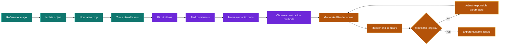
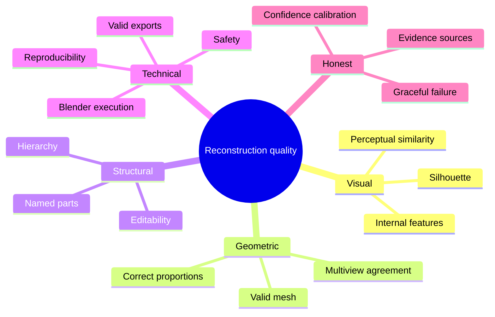
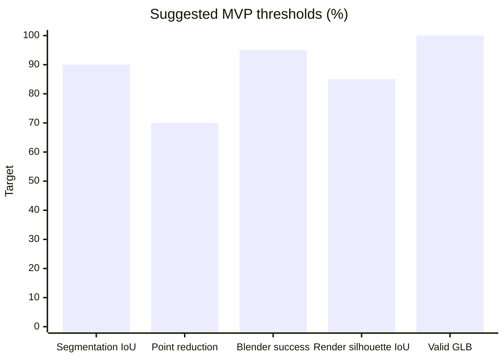

<div align="center">

# Recon3D

### From reference images to editable, explainable 3D models.

[](#how-it-works)
[](#how-quality-is-measured)
[](#what-a-run-produces)
[](#the-most-important-rule)



**[Read the complete goal](GOAL.md)** · **[Read the evaluation specification](EVAL.md)**

</div>

## What is Recon3D?

Recon3D is a modular system for turning one or more images of an object into an editable, semantically structured 3D model in Blender.

It does not jump directly from an image to one opaque mesh. Instead, it builds understanding step by step:

```text
image → mask → crop → vector traces → geometric primitives
      → semantic parts → construction plan → Blender model
      → rendered comparison → refined result
```

The goal is not simply to produce a render that looks good from one angle. The final scene should be understandable, editable, reusable, and organized into meaningful parts.

| A one-shot mesh may be… | Recon3D aims to be… |
| --- | --- |
| Difficult to inspect | Clear at every stage |
| Fused into one object | Split into meaningful parts |
| Hard to modify | Built from editable operations |
| Confident about hidden details | Honest about uncertainty |
| Judged by appearance alone | Tested for geometry, structure, safety, and usability |

## Why it matters

A wheel is not just a circular patch of pixels. It may contain a tyre, rim, spokes, hub, repeated patterns, shared centers, materials, depth, and hidden surfaces.

Recon3D tries to recover that structure. A successful wheel scene might look like this:

```text
Wheel_Assembly
├── Tyre
├── Rim
│   ├── Barrel
│   ├── Spokes
│   └── Hub
└── Axle_Mount
```

That makes the result useful for product visualization, design changes, animation, game export, 3D printing, and variant generation.

## The most important rule

An image contains evidence about a 3D object, not a complete description of it. Recon3D must keep facts and guesses separate.

| Evidence kind | What it means | Example |
| --- | --- | --- |
| Observed evidence | Directly visible in the image | Outer silhouette |
| Geometric inference | Fitted or estimated from visible geometry | Wheel radius |
| Semantic inference | Suggested by object knowledge | “This part is a handle” |
| Generated hypothesis | Invented to explain hidden geometry | Rear surface shape |
| User-supplied evidence | Given explicitly | Known physical width |

Important values should record their source and confidence:

```yaml
wheel_radius:
  value: 0.126
  unit: normalized_object_width
  source: fitted_outer_ellipse
  confidence: 0.91

rear_side_geometry:
  source: generated_hypothesis
  confidence: 0.31
```

When the evidence is weak, the correct answer is low confidence or `unknown`—not false precision.

## What objects are in scope?

The first version focuses on manufactured and hard-surface objects with readable silhouettes.

| Strong early candidates | More difficult cases |
| --- | --- |
| Wheels and rims | Transparent parts |
| Bottles, cups, and containers | Heavy occlusion |
| Boxes and enclosures | Reflective surfaces |
| Lamps and basic appliances | Severe perspective |
| Simple chairs and tables | Low contrast or motion blur |
| Brackets and mechanical parts | Highly organic shapes |
| Signs, logos, and reliefs | Objects with hidden internal structure |
| Stylized props | Ambiguous scale or depth |

Supported input guidance may include a text label, description, point, box, mask, or known physical dimension. Repeat `--image` to supply multiple views of the same object; secondary views are reconstructed independently and fused through source-labelled part matches, relative pose, and scale evidence.

## How it works

The system progresses through 18 replaceable stages.



### 1. See the object

| Stage | Purpose |
| ---: | --- |
| 1 · Input and selection | Load the image and identify the intended object |
| 2 · Segmentation | Separate the foreground object from the background |
| 3 · Crop and normalization | Center the object without stretching it and record the exact transform |
| 4 · Preprocessing | Create silhouette, color, structural-edge, detail, and lighting-normalized views |

The untouched image is always preserved because its background may contain useful evidence about shadows, scale, perspective, lighting, and contact with the ground.

### 2. Turn pixels into structure

| Stage | Purpose |
| ---: | --- |
| 5 · Vectorization | Convert important image layers into SVG paths |
| 6 · SVG cleanup | Remove noise, simplify paths, preserve holes, and normalize coordinates |
| 7 · Primitive fitting | Find lines, circles, ellipses, rectangles, arcs, polygons, and curves |
| 8 · Constraint detection | Find symmetry, alignment, repetition, tangency, shared centers, and other relationships |
| 9 · Parametric sketch graph | Store primitives, constraints, relationships, and uncertainty |
| 10 · Semantic parts | Group geometry into named object parts and hierarchies |

### 3. Reason about 3D construction

| Stage | Purpose |
| ---: | --- |
| 11 · Camera estimation | Estimate projection, pose, focal length, and scale when evidence allows |
| 12 · Depth and normals | Add surface-orientation evidence without mixing it into the vector evidence branch |
| 13 · Construction classification | Choose suitable modeling operations for each part |
| 14 · Construction plan | Describe the complete model in an editable, machine-readable plan |

Supported construction families include extrusion, revolution, sweep, primitive assembly, Boolean construction, lofting, freeform fitting, displacement, radial arrays, and mirror symmetry.

### Multiview and hidden-geometry reasoning

When a run contains more than one image, Recon3D processes every secondary view through segmentation, tracing, primitive fitting, semantic decomposition, depth, and camera estimation. It writes a shared-part graph, relative camera poses, scale consensus, and joint matching residuals to `geometry/multiview.json`. Secondary evidence annotates the primary graph; it never silently replaces primary observed geometry.

Hidden-side completion remains explicitly hypothetical. Procedural cross-sections, rear-surface continuations, mirror completions, and occlusion completions are scored against operator, constraint, and multiview evidence. Every proposal is accepted or rejected in `geometry/hypotheses.json`, uses `source: generated_hypothesis`, and is capped at confidence 0.5.

### 4. Build, check, and improve

| Stage | Purpose |
| ---: | --- |
| 15 · Blender generation | Create named objects, hierarchy, source curves, modifiers, pivots, and exports |
| 16 · Materials | Estimate basic PBR properties without baking lighting into material color |
| 17 · Render validation | Compare the model with the reference using several visual and geometric signals |
| 18 · Refinement | Change responsible parameters, keep improvements, and record an audit trail |

The refinement loop is deliberately simple:

```text
generate → render → compare → find the largest mismatch
         → adjust its parameters → render again → keep the best valid result
```

## What a run produces

Each reconstruction should create a self-contained, inspectable project:

```text
project/
├── input/
│   └── original.png
├── segmentation/
│   ├── object_mask.png
│   ├── object_rgba.png
│   └── crop_metadata.json
├── traces/
│   ├── silhouette.svg
│   ├── color_regions.svg
│   ├── structural_edges.svg
│   └── details.svg
├── geometry/
│   ├── fitted_primitives.json
│   ├── sketch_graph.json
│   ├── depth.png
│   ├── normals.png
│   ├── multiview.json
│   ├── hypotheses.json
│   ├── multiview/views/view_001/...
│   └── construction_plan.yaml
├── blender/
│   ├── build_model.py
│   ├── scene.blend
│   └── model.glb
├── validation/
│   ├── reference_overlay.png
│   ├── silhouette_comparison.png
│   ├── depth_comparison.png
│   ├── turntable.mp4
│   └── metrics.json
└── report.md
```

The result is more than `scene.blend`. The traces, plan, comparisons, metrics, uncertainties, and report explain how the model was produced and where it may be wrong.

## How quality is measured

No single score can prove that a reconstruction is good. Recon3D evaluates four levels:

| Level | What it checks | Examples |
| --- | --- | --- |
| A · Unit | Individual functions | Crop transforms, circle fitting, file export |
| B · Stage | One pipeline stage at a time | Segmentation, primitive fitting, camera estimation |
| C · End-to-end | The full reconstruction | Blender execution, render agreement, valid exports |
| D · Human and task | Real usefulness | Editing, animation, games, printing, variant creation |

Quality is divided into several kinds of correctness:



### MVP targets



| Metric | Suggested target |
| --- | ---: |
| Segmentation IoU on curated images | ≥ 0.90 |
| Silhouette vector error | ≤ 2% of object diagonal |
| Control-point reduction from raw SVG | ≥ 70% |
| Blender execution success | ≥ 95% |
| Reference-view silhouette IoU | ≥ 0.85 |
| Valid GLB export for successful runs | 100% |

The broader evaluation covers 30 areas, including input safety, topology preservation, semantic part accuracy, camera estimation, uncertainty calibration, runtime, regression testing, ablations, human preference, and downstream tasks.

## Hard acceptance gates

A result must not be marked successful if any of these are true:

- The wrong target object was selected.
- The crop transform is invalid.
- The construction plan fails validation.
- Blender cannot execute the generated scene or reopen it.
- The GLB export is invalid.
- A major visible part is missing.
- Hidden geometry is presented as directly observed.
- The final model is not meaningfully editable.
- The reference silhouette falls below the minimum threshold.
- Any unauthorized code execution occurs.

The system may report one of four honest outcomes:

| Outcome | Meaning |
| --- | --- |
| Success | All hard gates pass and the result is usable |
| Partial success | The model is usable, but some uncertain geometry remains approximate |
| Failed validation | A model was produced but a hard gate failed |
| Unsupported input | The image does not contain enough reliable evidence |

A render by itself is never proof of success.

## The benchmark

Evaluation should use a curated mix of synthetic renders and real photographs. Synthetic data provides exact cameras, masks, depth, normals, and geometry; real photographs reveal failures that clean renders can hide.

| Difficulty | Typical conditions |
| --- | --- |
| Easy | Isolated object, clean background, canonical camera, diffuse light |
| Medium | Mild clutter, perspective, mixed materials, partial occlusion |
| Hard | Reflection, transparency, blur, heavy occlusion, ambiguous scale |

The benchmark should cover rotational objects, extruded profiles, boxes, primitive assemblies, radial structures, furniture, appliances, mechanical parts, logos, symmetric products, and asymmetric products.

Where possible, each case should include the source image, foreground mask, bounding box, camera calibration, known dimensions, reference 3D model, part hierarchy, materials, visible contours, and rendered views.

The full pipeline must also be compared with simpler baselines:

1. Direct SVG extrusion.
2. Direct image-to-mesh generation.
3. A one-shot vision-model-to-Blender-script workflow.
4. The complete structured pipeline.
5. Versions without refinement, depth, normals, or primitive fitting.

Every component should earn its place through measurable value or an important operational safeguard.

## Development roadmap


| Phase | Main deliverable |
| ---: | --- |
| 1 | Image → clean parametric 2D sketch |
| 2 | Parametric sketch → semantic part graph |
| 3 | Semantic graph → editable Blender model |
| 4 | Blender model → validated reference-view reconstruction |
| 5 | Better profiles, ordering, recesses, and protrusions from depth |
| 6 | Shared geometry and cameras across multiple views |
| 7 | Clearly labeled and validated hypotheses for hidden geometry |

Starting with deterministic 2D evidence creates a stable base for every later inference step.

## Where to start

Choose the path that matches your interest:

| If you care about… | Start with… |
| --- | --- |
| The product vision | [GOAL.md](GOAL.md) |
| Metrics and proof | [EVAL.md](EVAL.md) |
| Computer vision | Segmentation, preprocessing, vectorization, and depth |
| Geometry | Primitive fitting, constraints, camera estimation, and construction methods |
| Blender | Editable scene generation, materials, validation renders, and export |
| ML evaluation | Benchmark cases, confidence calibration, baselines, and ablations |
| UX for creators | Diagnostic reports, edit tasks, and clear failure explanations |

## Honest limits

A single RGB image usually cannot uniquely determine:

- Absolute physical scale
- Hidden and rear surfaces
- Exact depth and cross-sections
- Internal structure
- True material composition
- Lens parameters
- Whether a line is geometry, texture, shadow, or reflection

Recon3D should produce the **simplest plausible editable model that agrees with the available evidence**. It should expose ambiguity, reject unsupported claims, and explain its assumptions.

## Final success definition

The project succeeds when it can turn a suitable reference image into an editable Blender model whose:

- Silhouette matches the reference.
- Major parts are identified correctly.
- Geometric relationships are preserved.
- Construction history is understandable.
- Important parameters can be changed.
- Materials are approximately correct.
- Hidden geometry is clearly marked as inferred.
- Output can be exported and reused.
- Reconstruction process can be inspected and reproduced.
- Evaluation gates pass.

> **Convert images into structured geometric evidence first, then use that evidence to construct and refine an editable 3D model.**

---

<div align="center">

**A useful 3D reconstruction is visually supported, geometrically coherent, structurally editable, technically valid, and honest about uncertainty.**

</div>
